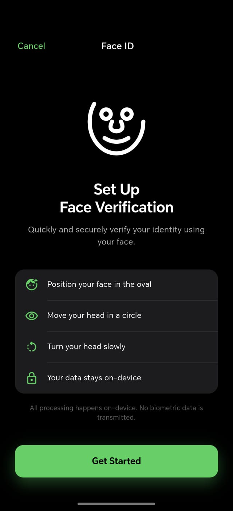
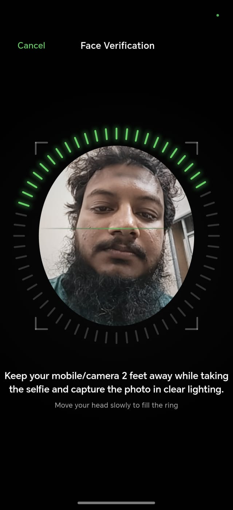

# Face Liveness KYC - iOS Style

A production-ready Face Liveness Verification KYC application for Flutter, featuring a premium "Face ID" setup experience with a 360-degree circular progress ring.

## ✨ Features

- **iOS-style Circular Liveness**: Interactive 360° progress ring that fills as you rotate your head.
- **On-Device Processing**: High-performance face detection using Google ML Kit.
- **Anti-Spoofing Ready**: Integrated TFLite support for spoof detection models.
- **Premium UI/UX**: Dark mode, elastic animations, and fluid transitions inspired by Apple's design.
- **Optimized Sensitivity**: Smoothed head-tracking with calibrated sensitivity for a natural feel.
- **Localization Ready**: Centralized string management for easy internationalization.

## 📸 Screenshots

| Intro Screen | Liveness Verification |
| :---: | :---: |
|  |  |

## 🚀 Getting Started

### Prerequisites

- Flutter SDK: `>=3.29.0`
- Dart SDK: `>=3.3.0 <4.0.0`
- Android SDK: API 28+ (minSdkVersion)
- iOS: 12.0+

### Installation

1. Clone the repository:
   ```bash
   git clone https://github.com/your-repo/liveliness.git
   ```
2. Install dependencies:
   ```bash
   flutter pub get
   ```
3. Run the application:
   ```bash
   flutter run
   ```

## 🛠 Technical Details

- **State Management**: [Riverpod](https://pub.dev/packages/flutter_riverpod)
- **Face Detection**: [google_mlkit_face_detection](https://pub.dev/packages/google_mlkit_face_detection)
- **Animations**: [flutter_animate](https://pub.dev/packages/flutter_animate)
- **Camera**: [camera](https://pub.dev/packages/camera)

## 📁 Project Structure

- `lib/core`: App constants, theme, and utility functions.
- `lib/kyc/controller`: Logic for face detection, liveness challenge, and camera management.
- `lib/kyc/presentation`: UI screens and custom painters for the Face ID experience.
- `lib/kyc/model`: Data models for KYC process steps.

## ⚖️ License

This project is licensed under the MIT License - see the LICENSE file for details.
